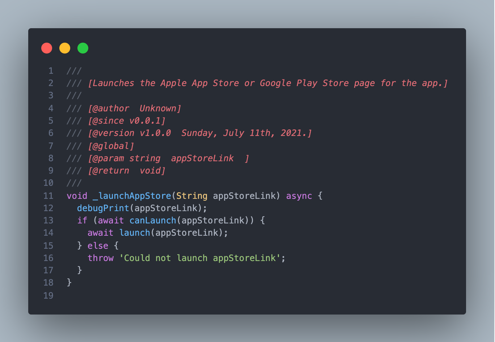

 

   
   
   
    
  
   

    <h1 align="center">Flutter Doc Blocker</h1>
   

   
  

    
   
  
  
   

   
   

<!-- # flutterdocblocker -->

Simply provides an easy to use Documentaion Blocker generator with mininal amount of effort.

## Languages

+ Dart
+ Flutter

## Features

+ Press alt+1 when line is on a variable, function or class. This will generate the docblock. As a bonous, each time you press alt+1 it will add a new @version tag.

+ Press alt+1 within an already generated DocBlock and it will do any nesscary updates to it (does not auto add @version like below).
 

<!-- > Tip: Many popular extensions utilize animations. This is an excellent way to show off your extension! We recommend short, focused animations that are easy to follow. -->

## Requirements

+ Visual Studio Code v1.58.0 and above.
+ node.js <https://nodejs.org/en/download/>

## Extension Settings

+ By default press alt+1 when cursor is on line of a variable, class, or function.

## Release Notes

Users appreciate release notes as you update your extension.

### 1.0.0

Initial release of ...
